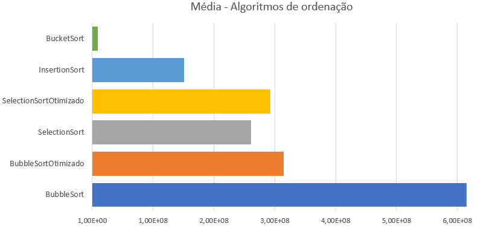

# Atividade - Estrutura de Dados
O repositório foi criado com o intuito de realizar a atividade de teste de eficiência de diferentes algoritmos de ordenação em C++, bem como teste de desempenho na criação de árvores e listas, bem como o uso de diferentes métodos de busca nessas mesmas estruturas, proposta na matéria Estrutura de Dados da FGV-EMAp.

## Algorítmos de Ordenação

Os testes aqui realizados foram feitos para estruturas com 10000 dados, usando inteiros aleatórios de **1** a **100**. Foram criadas listas identicas a cada teste, assim, todos os algoritmos ordenaram uma cópia da mesma lista.

Com o csv dos tempos de cada algoritmo, realizamos uma análise sobre cada método de ordenação. Para começar, tiramos algumas estatísticas, como apresentado na tabela 1 abaixo:

Tabela 1: Algoritmos de Ordenação
|                | BubbleSort  | BubbleSort Otimizado | SelectionSort | SelectionSort Otimizado | InsertionSort | BucketSort |
|----------------|-------------|---------------------|---------------|------------------------|---------------|------------|
| Média          | 9,68E+08    | 5,55E+08            | 2,99E+08      | 3,44E+08              | 2,31E+08      | 1,77E+07   |
| Mediana        | 8,96E+08    | 5,02E+08            | 2,75E+08      | 3,20E+08              | 2,12E+08      | 1,52E+07   |
| Desvio Padrão  | 2,14E+08    | 1,34E+08            | 7,78E+07      | 6,77E+07              | 5,93E+07      | 8,36E+06   |

Então, resolvemos usar a **média** para plotar um gráfico, facilitando a comparação:

Agora, fica claro que o algoritmo que apresentou a melhor performace foi o **Bucket Sort**, seguido do **Insertion Sort** e do **Selection Sort Otimizado**, nessa ordem. O algoritmo de pior performace foi o **Bubble Sort**.

## Arvores e listas

Aqui, implementamos um código para a criação de uma árvore binária, onde os menores valores sempre são alocados à esquerda. Os algoritmos BFS (Breadth First Search) e DFS (Depth First Search) foram implementados considerando uma aplicação em uma árvore genérica, não necessariamente em uma árvore construída de uma forma específica.

Os testes aqui realizados foram feitos para estruturas com 10000 dados, usando inteiros aleatórios de **1** a **10000**, tanto para árvore quando para lista. Para a busca, escolhemos 5 inteiros aleatóriamente (os mesmos inteiros para todas as estruturas) e aplicamos cada um dos algoritmos. Então, tiramos a média dessas 5 buscas e adicionamos ao csv.

Segue abaixo a tabela 2 com os tempos médios e outras estatísticas relacionadas à criação de estruturas e aos tempos de busca:

Tabela 2: Tempos de Busca e Criação de Estruturas
|                | Tree Creation Time | List Creation Time | DFS Time | BFS Time | List Search Time |
|----------------|--------------------|--------------------|----------|----------|------------------|
| Média          | 4,37E+06           | 9,06E+05           | 2,68E+05 | 1,13E+06 | 6,64E+04         |
| Mediana        | 3,97E+06           | 8,06E+05           | 1,88E+05 | 1,00E+06 | 5,24E+04         |
| Desvio Padrão  | 1,32E+06           | 3,43E+05           | 5,90E+05 | 5,22E+05 | 4,66E+04         |

Esses dados são fundamentais para entendermos a eficiência e o desempenho das estruturas de dados em diferentes cenários e para diferentes propósitos. Vale ressaltar que há o uso de uma lista encadeada generica no algoritmo BFS, não otimizada para essa aplicação. Realizamos alguams otimizações simples, como a adição de um ponteiro apontando ao último elementos, assim podendo acessar esse elemento sem percorrer a lista.

Disclaimer: A execução do algoritmo foi feita usando o Visual Studio Code, executado com a placa de vídeo dedicada (pode ser insignificante) no sistema operaciona Ubuntu 23.10.

**Alunos:**\
Gustavo Tironi\
Luís Felipe de Abreu Marciano
